# Bare Metal STM32

*Setting up Startup, linkerscript and Makefile*

## Table of Contents

| Sections | Description |
|----------|-------------|
| [Introduction](#intro_reg_lev) | Introduction to bare-metal register-level programming of STM32 |
| [Bitwise Operators](#Bitwise_operators) | Basics of bitwise operators and compound operators |
| [ARM-GNU-Toolchain](#arm-gnu-toolchain) | Explanation of GNU-Toolchain and on-chip debugging and flashing |
| [OpenOCD](#OpenOCD) | Explanation debugging and flashing using OpenOCD |
| [Linker Script](#linker_script) | Step-by-step walk through of a basic linker script for a STM32 board |
| [Startup](#startup) | Step-by-step walk through of a basic startup file for a STM32 board |
| [Makefile](#makefile) | Step-by-step walk through of a basic Makefile for a STM32 board |
| [Blinky-Project](#blinky) | This section describes the register-level programming for creating a blink project |
| [Demonstration of Compiling and Debugging](#demo) | This section demonstrates how to compile and flash the STM32F401RE |
| [Code and Documentation](#share_repo) | Check out my code and documentation! |

<a id="intro_reg_lev"></a>
## Introduction

Suppose you’ve ever wondered how to set up a bare metal register level C program for developing embedded systems without an IDE or libraries such as HAL or any other abstractions. In that case, this blog post is for you! First, let’s define what register-level programming is and why you would want to use this approach.

Register-level programming is low-level programming where operations are carried out directly on the hardware registers of a processor. This is in contrast to the higher-level programming approach, which is done by applying modifications using abstractions such as functions and objects. There are numerous reasons why you would want to program at the register level:

1. First, it can be very powerful, as it provides more precise control and flexibility over the hardware
2. Second, it can be used to create very efficient code, since you’re not dealing with the overhead of higher-level abstractions
3. Third, it’s necessary for circumstances where operations must be performed that otherwise would be very difficult or even impossible at a higher level
4. And finally, IT CAN BE MORE FUN! :)

Still it’s important to keep some disadvantages in mind using this approach:

1. First, it can be very difficult to debug register level code, as it is hard to read and follow the logic of the code,
2. Second, it can be dangerous, as it’s easy to make mistakes and even damage the hardware

Though register level programming can be difficult as it requires proficient knowledge about the hardware, it can be very rewarding as you can get maximum out of your embedded system.

To get started some requirements are:

1. A good development board, ie. from ST, Texas Instruments or Arduino, etc. (The board used in this example is STM32F401RE)
2. A compiler and an assembler (The compiler used in this example is arm-none-eabi-gcc source: [Click here](https://developer.arm.com/Tools%20and%20Software/GNU%20Toolchain))

These tools will allow us to write and compile code. Furthermore, register-level programming also requires knowledge of how to use bitwise operations. Bitwise operators perform bit-level modifications to integer-type values. Those operators are AND, OR, and XOR, which can be used to set, clear, toggle or invert individual bits. These operators can be very powerful, but also somewhat confusing. The following section provides a quick overview of the most important applications of these operators.

<a id="Bitwise_operators"></a>
## Bitwise Operators

| Operator | Examples |
|----------|----------|
| ANDing | 0x2F & 0xF0 = 0x20 // is used to clear individual bits |
| ORing | 0x50 \| 0x11 = 0x51 // is used to set individual bits |
| XORing | 0x01 ^ 0x11 = 0x10 // is used to toggle individual bits |
| Inverting / NOT | ~0x55 = 0xAA // is used to invert individual bits |
| Shift Left | 0b0001 << 3 = 0b1000 // 1 has shifted 3 positions to the left |
| Shift Right | 0b1000 >> 3 = 0b0001 // 1 has shifted 3 positions to the write |

<a id="arm-gnu-toolchain"></a>
## ARM-GNU-Toolchain

The GNU Toolchain is a collection of programming tools produced by the GNU Project. It’s used to turn source code into executables. It is a powerful tool that is completely free and highly portable. It includes the GNU Compiler Collection (GCC), the GNU Debugger (GDB), and further binaries and tools that are well-maintained.

The ARM GNU Toolchain is a collection of these tools specialized for ARM - Chips. The flow diagram below illustrates how the ARM-GNU Toolchain compiles source files into a finished executable.

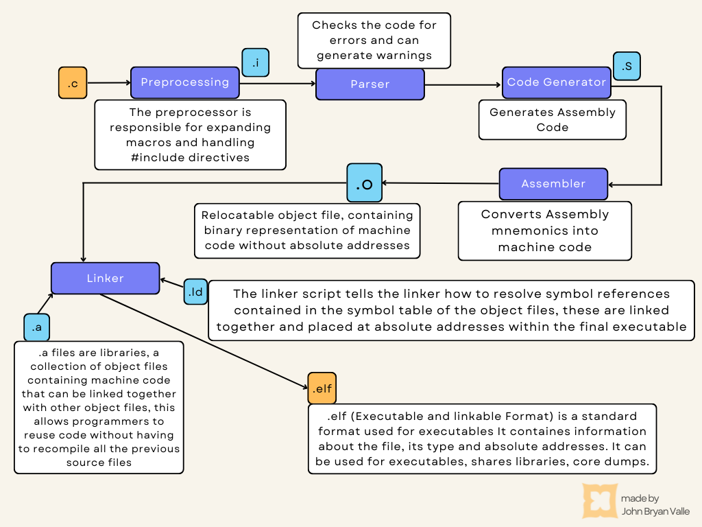

<a id="OpenOCD"></a>
## OpenOCD

There are multiple ways for debugging and flashing the finished executable onto the chip, however, in this example, the free open-source on-chip debugger OpenOCD is used. The following flow diagram illustrates how OpenOCD flashes and debugs the executable on the chip.

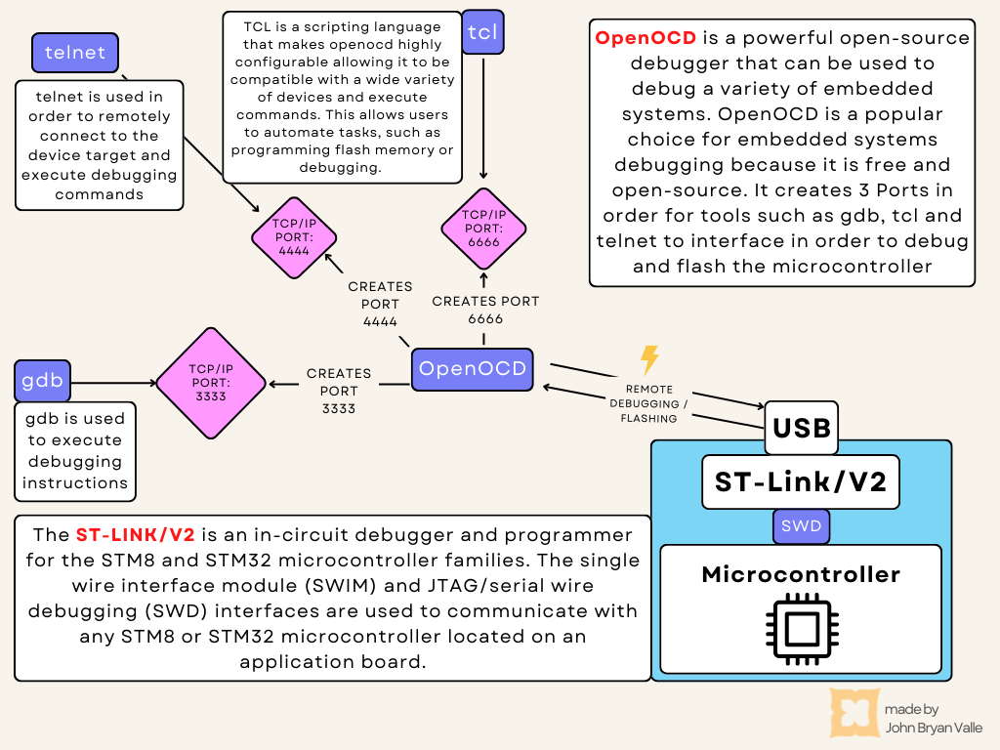

OpenOCD needs scripts for the target (ie. microcontroller) and interface (ie. debugger) because it uses an embedded debugger to communicate with the target device. The debugger needs to know how to interface with the target device in order to properly communicate with it. The scripts provide this information to the debugger. The following code will later be used in order to debug and flash the program onto the microcontroller.

```bash
$ openocd -f /usr/share/openocd/scripts/interface/stlink-v2.cfg -f /usr/share/openocd/scripts/target/stm32f4x.cfg
```

<a id="linker_script"></a>
## Linker - Script

The purpose of the linker script is to link together various pieces of code and data to form a complete executable. Its role is to provide the necessary runtime environment for the system to function properly. In order to write a linker script the GNU linker script language is used, which is actually a subset of the C programming language.

The linker itself is a program integrated in the GNU Compiler Collection (GCC), which utilizes the linker script to determine how to map the contents of an executable file into memory. It controls the memory layout of an executable, including where in memory the executable’s code and data are placed. Additionally, it controls the linking process itself.

A Linker Script contains multiple sections, the memory section the define various memories in the systems and their attributes. The attribute of a memory includes its size, its starting address, its type and its reading permissions. The actual documentation for those sections can be looked up in the official GNU Documentation. A snippet of the documentation describing the memory section is provided in the following image.

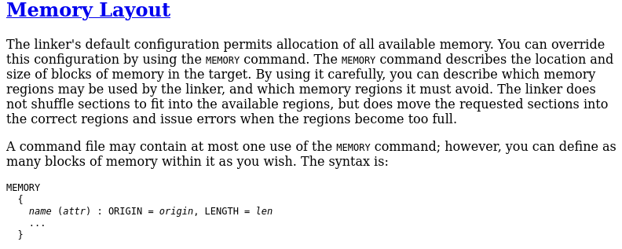
*GNU Linker Documentation of Memory Section*

The regions sections defines the various regions in the memories. A region is a contiguous block of memory with a specific purpose. For example, a region may be created for the code, data or stack. This sections tell the linker how to link the various pieces of code and data together. A snippet of the documentation describing the regions section is provided in the following image.

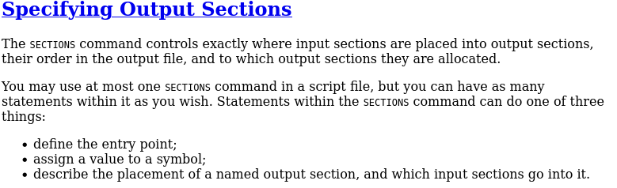
*GNU Linker Documentation of Region Section*

##### The following code contains the actual code of the linker script used in this example

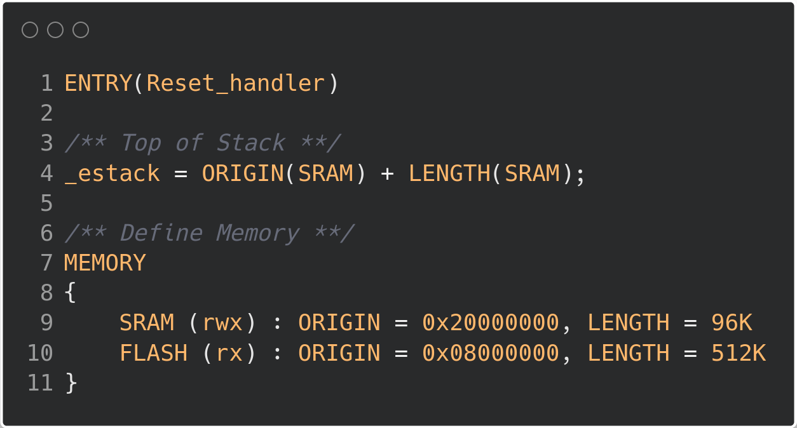

| Line(s) | Description |
|---------|-------------|
| [Line:1] | the first entry point of the microcontroller, the reset_handler which handles the main hardware and software initializations |
| [Line:4] | the top address of the stack, this is required by the manufacturer |
| [Line:7] | as well as the actual memory section. This section defines that RAM memory has read \| write \| execute rights, with a starting address at 0x20000000 with a total size of 96KB. Additionally FLASH is defined to have read \| execute rights, with a starting address at 0x08000000 and a total size of 512KB. All these information is specific to the STM32F401RE microcontroller. |

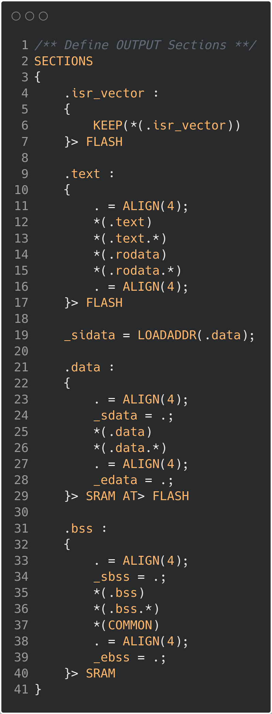

| Line(s) | Description |
|---------|-------------|
| [Line:2] | This is the Region Section, which tells the linker which parts of the code should be linked together |
| [Line:4] | The Code Sections which are associated with the .isr_vector symbol will be linked together and placed in the FLASH memory |
| [Line:9] | The Code Sections associated with .text and .rodata are linked together, meaning the actual code and read only memory such as constants will be placed in the .text memory section in FLASH |
| [Line:19] | This Line writes the starting address of the .data section into the symbol _sidata, this is lated used to copy the data section from FLASH to RAM |
| [Line:21] | All .data sections, meaning all initialized global and local static variables will be placed in a united .data section. Line 29 tells the linker that during loading .data will be placed in the FLASH and later in the SRAM memory during runtime. Additionally _sdata and edata are initialized denoting the staring and ending address of .data, which are are lated used in the reset handler to copy data from FLASH to RAM. |
| [Line:31] | All .bss sections, meaning all uninitialized global and local variables will be linked together in a .bss section in SRAM. Additionally _sbss and ebss are initialized denoting the staring and ending address of .bss, which are are lated used in the reset handler to initialized previously uninitialized values with zero. |

<a id="startup"></a>
## Startup File

The Startup File is the first piece of code that runs when an embedded system is turned on. It is responsible for initializing the hardware and software of a system. The startup file is typically written in C or assembly language. In this example, C language was used.

The two main parts of a startup file is

- the vector table and
- the startup code, defined in the Reset Handler

### The Vector Table

The vector table is a table of pointers to the interrupt handler functions.
In embedded systems, a vector table is a data structure that contains a list of pointers to functions that the processor can execute. The vector table is typically located at the beginning of memory and is used by the processor to determine which functions to execute when an interrupt occurs. When an interrupt occurs, the processor looks up the address of the function to execute in the vector table, and then branches to that address. This allows the processor to execute the correct function for the type of interrupt that occurred. The vector table is a critical part of an embedded system and must be carefully designed to ensure that the processor can correctly handle all types of interrupts that may occur.

### The Reset Handler

The startup code is the code that initializes the hardware and software of the system.

One of the most common ways to reset an embedded system today is through the use of a reset handler. A reset handler is a piece of code that is executed when the system is reset. This code can perform any necessary actions to ensure that the system is brought back to a known state. One common use for a reset handler is to initialize all of the hardware and software components of the system. This ensures that everything is in a known state when the system starts up again. Reset handlers can also be used to perform other tasks such as logging the reset event or sending a notification to a remote monitoring system. The main tasks of a Reset Handler implemented in this example are:

| Task | Description |
|------|-------------|
| Copy Data from flash to ram | All data sections meaning all initialized global and local static data will usually be flashed onto the flash memory first. As data is part of the systems working memory, it has to be copied to the RAM to be able to apply read and write instructions to that memory. |
| Initialize the bss section with zeroes | The BSS section contains all uninitialized data. Therefore all its containing values will be assigned with zeroes |
| Call main function | The actual main entry point of the program will be called |

##### The following code contains the actual code of the linker script used in this example

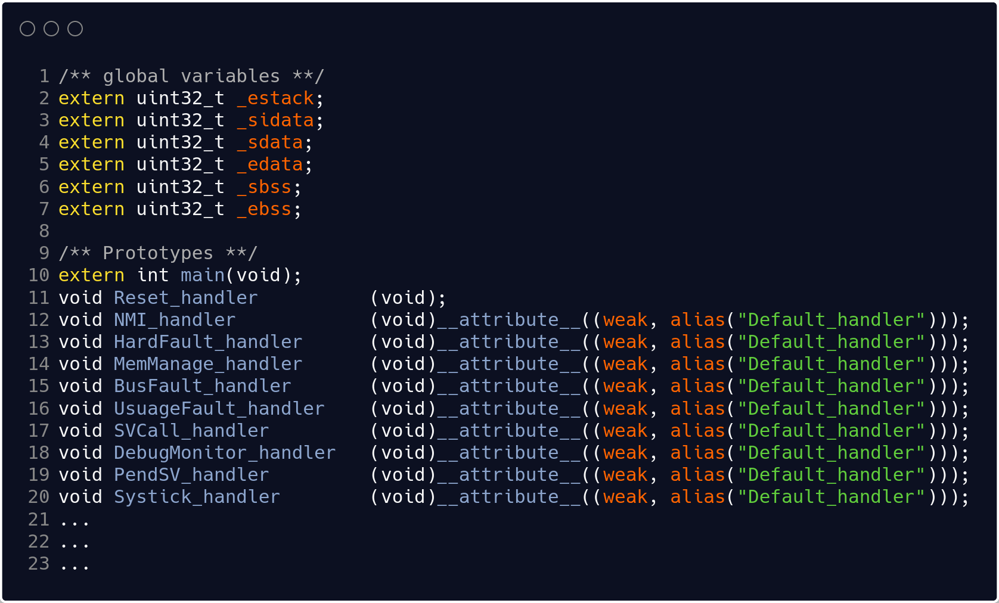

| Line(s) | Description |
|---------|-------------|
| [Line:2-7] | Here the symbol names taken from the linker script are initialized. These will later be used in the reset handler. |
| [Line:10-20] | The prototypes used to call main as well as the interrupt handlers of the microcontroller are initialized. These are documented in Reference Manual of the STM32F401RE. If the Interrupt Handlers are not initialized with a customized Handler, a default handler will be called instead. |

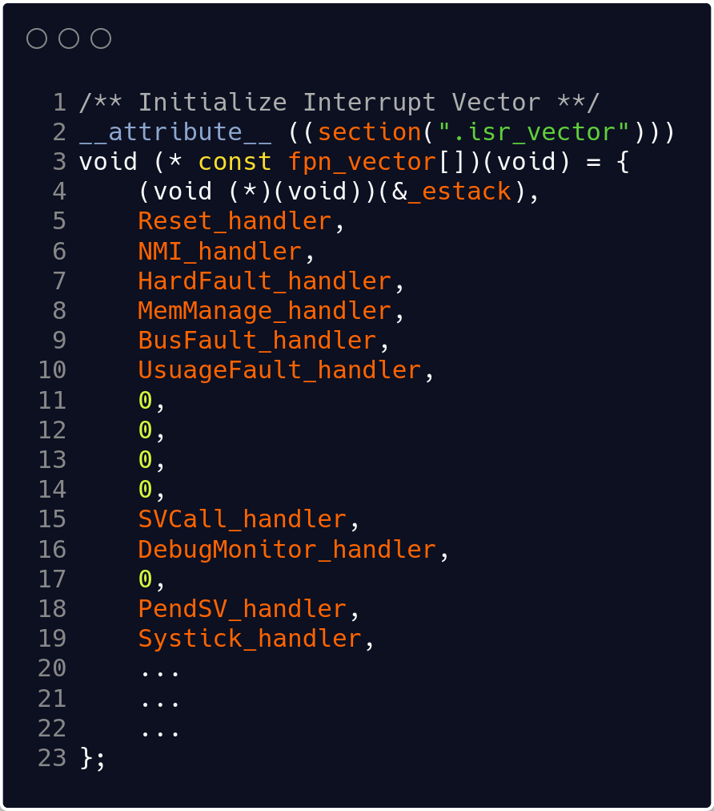

| Line(s) | Description |
|---------|-------------|
| [Line:2] | Here the array of function pointers are initialized using the section attribute. This will tell the compiler to place the array in the .isr_vector memory section in FLASH. |

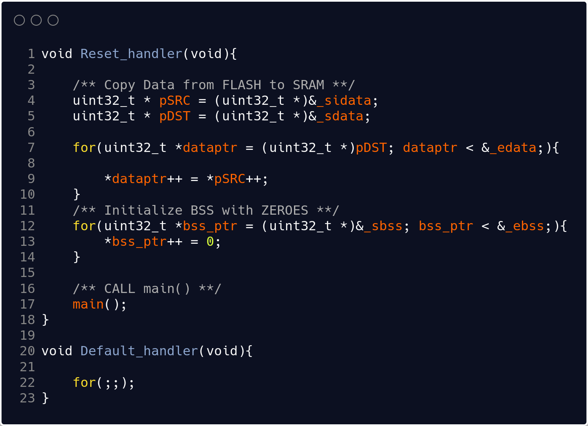

| Line(s) | Description |
|---------|-------------|
| [Line:4-5] | Here pSRC is assigned the starting address of data and pDST is assigned the ending address of data. Notice that an ampersand symbol is used for the symbols. This is due to the fact that the symbols _sidata and _sdata are not usual variables but symbols created in the linker script. In order access their value an Ampersand is needed. |
| [Line:7-10] | Each Value of .data in the RAM memory is overwritten with the values from .data in FLASH, thereby copying .data from FLASH to RAM. |
| [Line:12-14] | All values of the bss section are assigned with zeroes. |
| [Line:10-23] | An endless loop, that will be entered ones an interrupt handler is called which has not been initialized. This is a common method to set up a basic program without having to define each handler. |

<a id="makefile"></a>
## Makefile

A makefile is a file that contains a set of instructions that tell a computer how to compile and link a program. In embedded systems, a makefile is often used to build a firmware image. A firmware image is a binary file that contains all of the code and data necessary to run a piece of hardware. In embedded systems, this binary file is often stored in flash memory. When you create a new project, you will typically start with a blank makefile.

##### The following code contains the actual code of the makefile used in this example:

> **Upcoming!** A new blog post explaining Makefiles will be published soon, stay tuned!

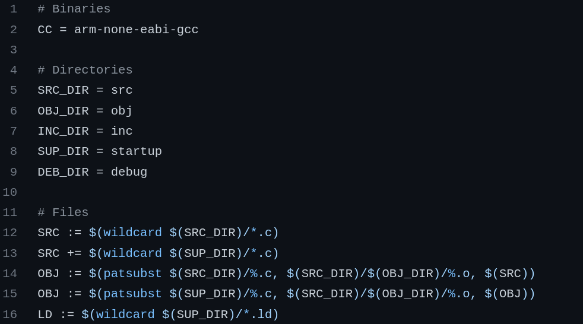

| Line(s) | Description |
|---------|-------------|
| [Line:2] | Here we assign the CC macro with the name of the arm cross compiler |
| [Line:5-9] | This macros are used to assign names to the directories used in this project. This is specific to this example and can be configured to suit the project's needs. |
| [Line:12-13] | Using the wildcard feature of "make" we assign all the c file names to one single macro, which we can later use during compilation |
| [Line:14-15] | Here the values assigned to the SRC macros are substituted with a .o exten using the patsubst feature. Furthermore, its file paths have been changed with that of the directory make for object files. This also is specific to this project. |
| [Line:16] | Lastly the macro LD is used to hold the name of our linker script |

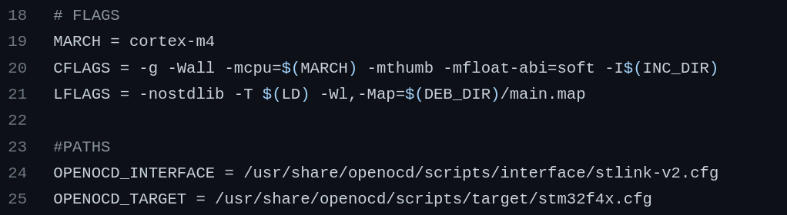

| Line(s) | Description |
|---------|-------------|
| [Line:19] | The MARCH macro is the processor used for this project. This will later be used during compilation |
| [Line:20] | These are the flags used during compilation. -g is used to generate debugging information. -Wall is an option used by the compiler to generate warnings. -mcpu and -mthumb tell the compiler which cpu is used and that thumb instructions are used. -mfloat-abi=soft tells the compiler, that floating functionalities will be enabled by a software implementation. -I tells the compiler where to look for include files, in this project this is used, as the Peripherals have been implemented using structs which are placed in the include directory. |
| [Line:21] | These are the linker flags. -nostdlib means no standard library functions are used that need to be linked. -T tells the linker where to search for the linker script. -Wl, tells the linker that linker options are being passed. -Map is used to generate a map file of the executable which is very helpful for debugging purposes. |
| [Line:24-25] | These are the paths to the openOCD scripts used to tell openOCD how to connect and communicate with the on chip ST-Link V2 debugger, as well as the debugger unit on the STM32F401RE. |

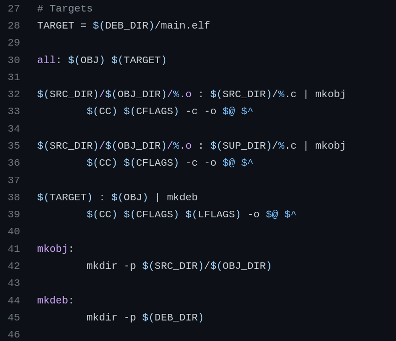

| Line(s) | Description |
|---------|-------------|
| [Line:28] | The TARGET is the macro used for our ELF executable |
| [Line:30] | In case "make" is executed by the default all files and targets specified after this keyword will be generated |
| [Line:32-36] | These are makefile rules, telling make to generate object files using the c source files. If the Object file directory is not present, the "mkobj" target is called which will create a directory needed for compilation |
| [Line:38-39] | This makefile rule, tells make how to generate the target using object file, similarly to mkobj it will call mkdeb if DEB_DIR is not available |

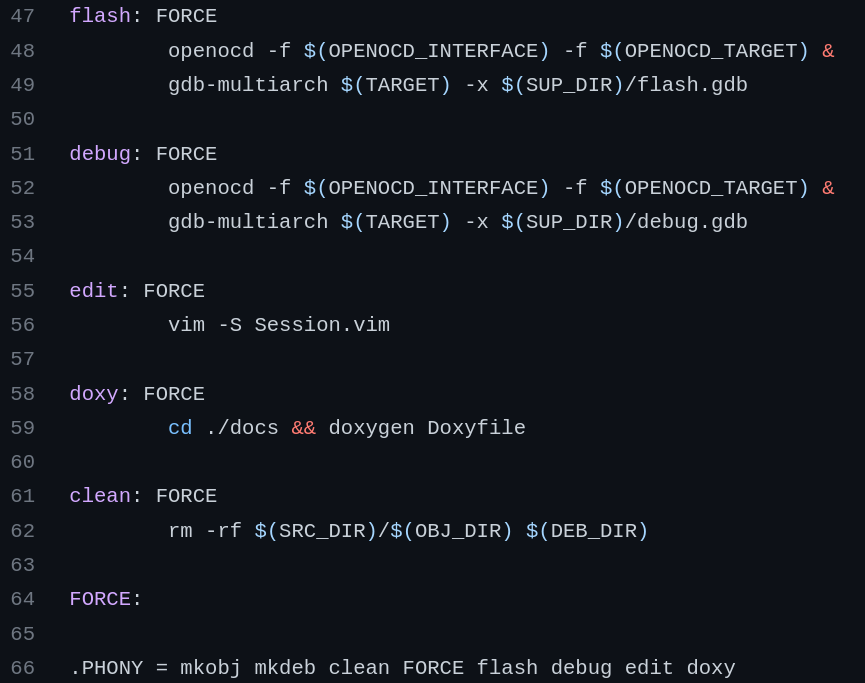

| Line(s) | Description |
|---------|-------------|
| [Line:47-49] | this target will call openocd and subsequently gdb-multiarch to flash the elf file onto the chip |
| [Line:51-53] | this target will also call openocd and gdb, however without flashing the elf |

<a id="blinky"></a>
## Blinky - Project

If you're working on register level programming for an embedded system, one thing you might want to consider is using struct pointers that are assigned with fixed addresses. This can be helpful in a number of ways. For one, it can make your code more readable. When you're working with a lot of registers, it can be difficult to keep track of what each one is used for. But if you give each register a meaningful name and then access it through a pointer, it can be much easier to understand what your code is doing. Another advantage is that it can make your code more efficient. If you know the address of a register, you can directly access it without having to go through any intermediate steps. This can be a significant speed boost, especially if you're working with time-critical code.

A peripheral can be defined using a struct with each of its registers initialized as the struct's members. The following code is the struct data structure of the STM32F401RE GPIO Peripheral.

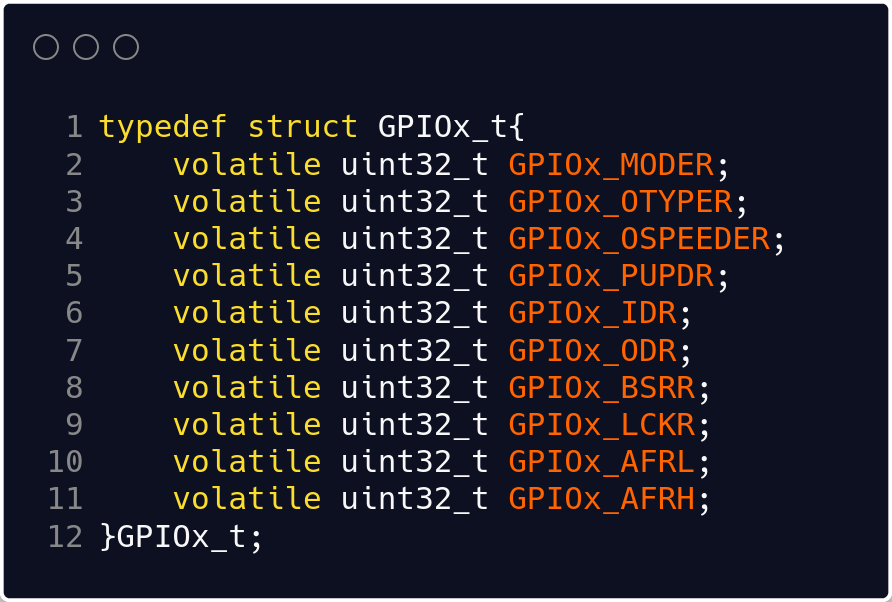

Now that the registers have been initialized, an instance of that struct can be assigned a fixed address from the system's memory, defined in the reference manual. A possible method is to instantiate a struct pointer which is then assigned an address, as illustrated by the following code:

```c
STRUCT_NAME * const defined_instance = (STRUCT_NAME *) ADDRESS;
```

To instantiate the GPIO Peripheral from the previously shown GPIOx_t using this method, we can now write:

```c
GPIOx_t * const GPIOA = (GPIOx_t *)0x40020000; // This address is specific to STM32F401RE
```

This code instantiates struct pointers with the pointer being constant, meaning the address should not be changed. However, the value of the address the pointer is pointing to can be accessed and manipulated, which is what we want for our purposes.

##### The following code contains the actual code of the startup file used in this example:

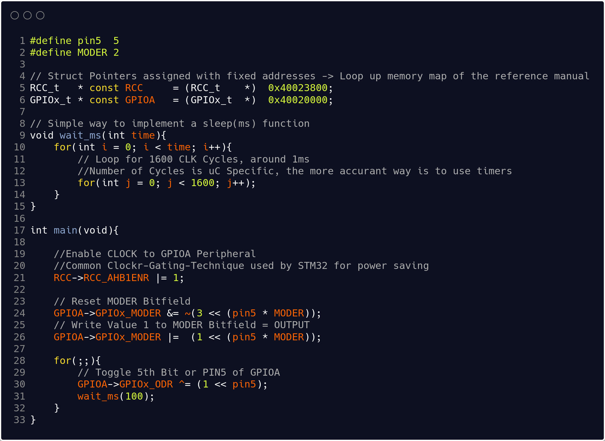

| Line(s) | Description |
|---------|-------------|
| [Line:1] | The macro pin5 is later used to configure and manipulate the Pin 5 of GPIOA |
| [Line:2] | The MODER Register is part of the GPIO Port which is later used to configure a pin either input, output or even assign an alternate function. As the width of MODER is a 2 Bit Bitfield, this value is used for a more readable code |
| [Line:5-6] | Here struct pointers of the RCC Peripheral (used to handle Clock Enabling in this example) and GPIOA Port is initialized and assigned with their associated fixed addresses in memory (This can be looked up in the reference manual under the "memory map" section) |
| [Line:9-13] | This is a simple delay function implementation generating an approximately 1ms delay every 1600 Clock Cycles with a 16MHz internal clock, which can generating the desired ms delay by looping the inner-for-loop by the amount of times certain ms are passed to the function |
| [Line:21] | One of the great features of the STM32 is its clock gating feature, which allows peripherals to save power when they are not in use. In a nutshell, clock gating is a power-saving technique that stops the clock signal to a particular circuit when that circuit is not in use. This prevents the circuit from wasting power by doing unnecessary work. In order to enable that peripheral we need to enable it using the Reset Clock Control Peripheral of the microcontroller. Using the AHB1ENR Register GPIOA is enabled by writing a 1 to that specific bit associated with that peripheral. |

<a id="demo"></a>
## Demonstration of Compiling and Debugging

The following video demonstrates how to compile and debug using ARM GNU tools, OpenOCD and gdb-multiarch:

<iframe src="https://www.youtube.com/embed/Nqi293aGV48" width="100%" height="100%" title="A YouTube video" frameborder="0" allowfullscreen></iframe>

The following video demonstrates how to compile and debug using Make to automate all the previously used tools:

<iframe src="https://www.youtube.com/embed/R3wwuPGrVLE" width="100%" height="100%" title="A YouTube video" frameborder="0" allowfullscreen></iframe>

<a id="share_repo"></a>
## Code and Documentation

If you're interested in seeing how this project was made, please check out the source code and documentation. All the code is available for you to view, and the documentation goes into detail about how everything works. Thanks for your interest!

If you have any questions about the project or any particular area that I haven't elaborated on properly, feel free to message me on any of the social media platforms that I've shared on my website. I'll be happy to answer any questions you may have.

- [GitHub](https://github.com/jbvalle/011_bare_metal_STM32F401RE_basic_setup)
- [Documentation](https://jbvalle.github.io/011_bare_metal_STM32F401RE_basic_setup/)
